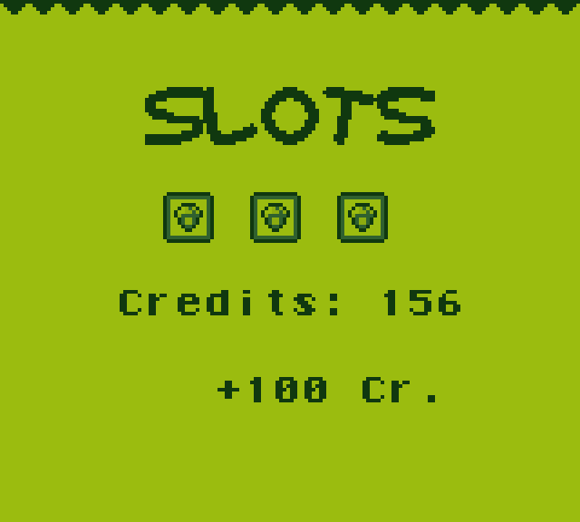

# GBSlots

GBSlots is an original new Gameboy Game - yes, in 2020. Although it's more of an experimental little project rather than a proper "game". It's about - as the name would suggest - a slot machine. There's a simple credit system in place and it GAME OVER's when your credits go down to zero.

## Game Instructions

Press START to start the slot machine, then START again to stop each slot wheel individually. The goal is to get 3 of the same symbol in the slots. The win amounts are as follows:

| **Symbol** | **Credits** |
| ---------- | ----------- |
| Seven      | 777 Credits |
| Cherry     | 250 Credits |
| Bell       | 150 Credits |
| Diamond    | 100 Credits |
| Watermelon | 50 Credits  |
| Lemon      | 25 Credits  |

## Technical Details

The ROM is a simple 32KB ROM with no MBC attached. This may change, as support for savegames is planned.

## Screenshots

